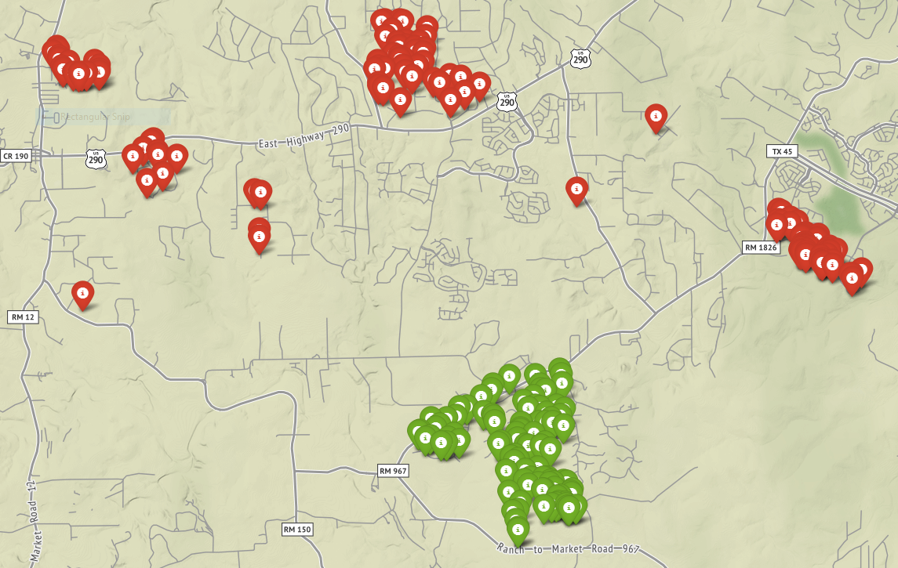

# Property Tax Research

Tools to lookup and map properties in property tax disputes. This was created as a personal tool so it is not as automated as it could be... the manual steps don't take that long and for my purposes this was acceptable.

## How to use the tool

As a first step, the property tax agency should provide the "evidence" they used to justify your property tax increase. In my case this was a list of parcels and values. As part of my evidence to present to the board I used this list to create a map of the parcels.

The code currently assumes you live in Hays county, Texas.

1. Create a text file `property_id_list.txt` listing all of the parcels the tax office is comparing you against. This is a single column of the parcel ids:
    - R1000000
    - R1000001
    - etc
1. Run `extract_addresses.py`. This will take the property ID and query the county tax tool for the parcel information. The parcel address is extracted from the returned HTML.
1. Review the output file `property_tax_addresses.txt` manually for errors and correct them in place. E.g. apostrophe might be an escape code instead of the character.
1. Run `convert_to_lat_long.py`. This assumes you have your [google map api key](https://developers.google.com/maps/documentation/embed/get-api-key) set up. It will use the extracted addresses to look up the latitude and longitude locations of all the addresses in `property_tax_addresses.txt` and save them in `lat_long_coords.txt`. This script assumes `my_api_key.txt` contains your google api key.
1. Again, review this list manually for any errors.
1. Run `map_list.py`. This will map all of the property coordinates in `lat_long_coords.txt`. This script assumes `my_location.txt` contains the coordinates of your residence. Edit `MAX_DISTANCE` to color code residences that are too far away for consideration.
1. Open `property_tax_map.html` in your browser.

In my case, this produces the following map, which clearly shows different clusters of neighborhoods.

